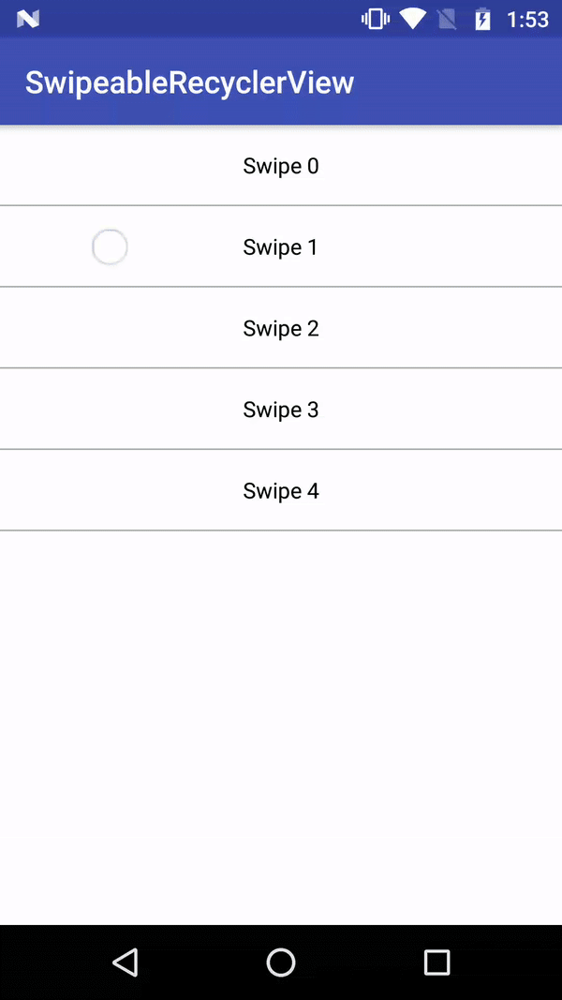

## Draggable RecyclerView

SwipeableRecyclerView provides a wrapper class `SwipeItemTouchHelperCallback` extends `ItemTouchHelper.Callback` which can be used to add Dragging capability to your RecyclerView items. You make use of `DataBinding` to bind it via XML.



## How to Use

```
    SwipeItemTouchHelperCallback swipeCallback = new SwipeItemTouchHelperCallback
            .Builder(0, ItemTouchHelper.LEFT | ItemTouchHelper.RIGHT)
            .bgColorSwipeLeft(bgColorSwipeLeft)
            .bgColorSwipeRight(bgColorSwipeRight)
            .drawableLeft(drawableLeft)
            .drawableRight(drawableRight)
            .setSwipeEnabled(swipeEnabled)
            .swipeLeftListener(onSwipeLeft)
            .swipeRightListener(onSwipeRight)
            .build();

    ItemTouchHelper itemTouchHelper = new ItemTouchHelper(swipeCallback);
    itemTouchHelper.attachToRecyclerView(recyclerView);
```

## How to Bind

In your `Gradle`

```
    dataBinding {
        enabled = true
    }
```

In your `BindingAdapter`

```
	@android.databinding.BindingAdapter(value = {"swipeEnabled", "drawableSwipeLeft", "drawableSwipeRight", "bgColorSwipeLeft", "bgColorSwipeRight", "onSwipeLeft", "onSwipeRight"}, requireAll = false)
	public static void setItemSwipeToRecyclerView(RecyclerView recyclerView, boolean swipeEnabled, Drawable drawableLeft, Drawable drawableRight, int bgColorSwipeLeft, int bgColorSwipeRight,
	                                              SwipeItemTouchHelperCallback.OnItemSwipeListener onSwipeLeft, SwipeItemTouchHelperCallback.OnItemSwipeListener onSwipeRight) {

		... // attach RecyclerView to SwipeItemTouchHelperCallback as above
	}
```

In your `XML` file

```
    <android.support.v7.widget.RecyclerView
        android:id="@+id/rv"
        android:layout_width="match_parent"
        android:layout_height="match_parent"
        android:background="@android:color/white"
        bind:bgColorSwipeLeft="@{@color/app_green}"
        bind:bgColorSwipeRight="@{@color/app_red}"
        bind:drawableSwipeLeft="@{@drawable/ic_check_white_24dp}"
        bind:drawableSwipeRight="@{@drawable/ic_close_white_24dp}"
        bind:onSwipeLeft="@{(position) -> handler.onSwipedLeft(position)}"
        bind:onSwipeRight="@{(position) -> handler.onSwipedRight(position)}"
        bind:swipeEnabled="@{true}"/>
```

## Library used

Add Android Support Design dependency to your gradle file.

```
    dependencies {
        compile 'com.android.support:design:{latest_version}'
    }
```

## Reference

- [ItemTouchHelper.SimpleCallback](https://developer.android.com/reference/android/support/v7/widget/helper/ItemTouchHelper.SimpleCallback.html)
- [Drag and Swipe with RecyclerView](https://medium.com/@ipaulpro/drag-and-swipe-with-recyclerview-b9456d2b1aaf)
- [Android custom Swipe view with RecyclerView](https://www.learn2crack.com/2016/02/custom-swipe-recyclerview.html)